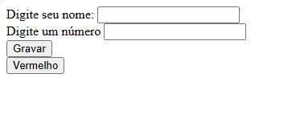
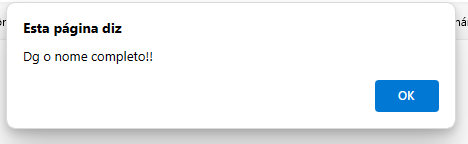
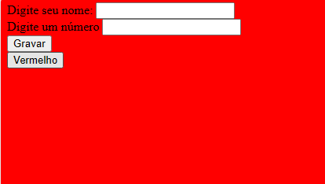
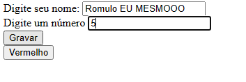
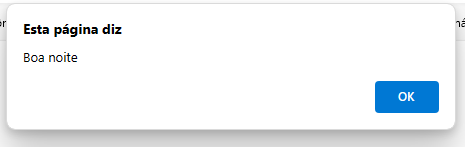
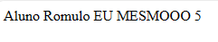

# javascript-NomeNumeroOnClick
mais umas functions das primeiras aulas de js.
  

  <h3>Página inicial</h3>
  

  

  <h3>Se digitar pouca coisa, dá esse aviso</h3>
  

  

  <h3>O botão com o texto "vermelho" faz piscar a tela em vermelho</h3>
  

  

  <h3>O outro botão pega as informações, dá um alert e apresenta elas</h3>
  

